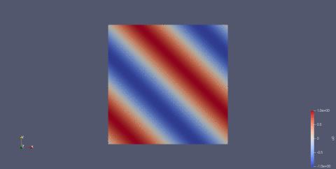

# Nektar++ solver for 2D Wave Equation example

This repo contains a sample solver for the wave equation using Nektar++.


## Compilation & installation

If you have compiled and installed Nektar++ elsewhere, you can manually configure and compile this solver through CMake:
```
mkdir build && cd build
cmake -DNektar++_DIR=/path/to/lib/nektar++/cmake ..
make install
```
By default and unless a `CMAKE_INSTALL_PREFIX` is supplied binaries will appear in `build/dist/bin`. If Nektar++ is built with MPI, this will be supported in the `WaveEquationSolver`.

## Right now it's broken

There appears to be an instability arising at the periodic boundaries where the derivative should be zero i.e. the periodic boundary in `x` when the dynamics are going like `sin(y - v t)`.

Instead of propagating a sine wave upwards through the box, it does this:


